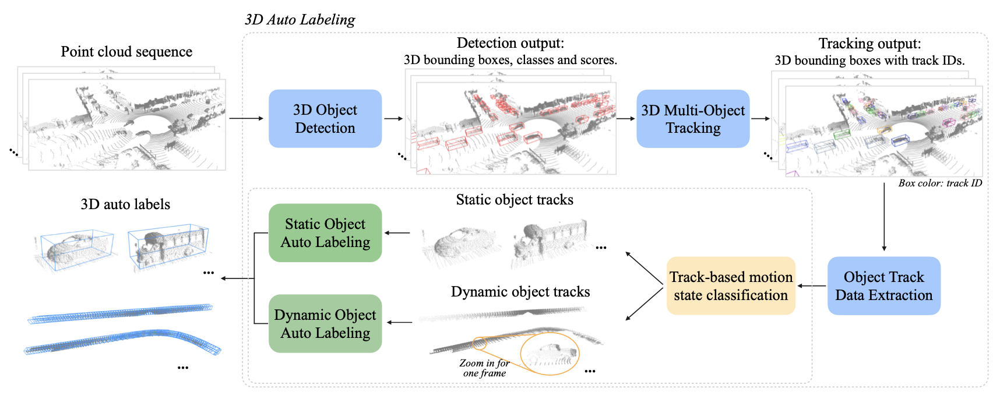
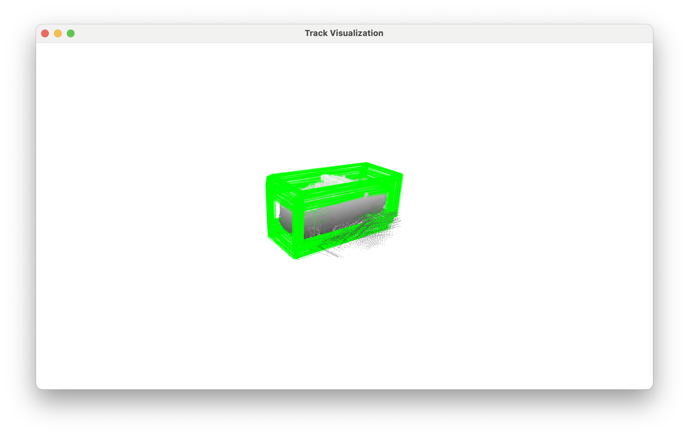
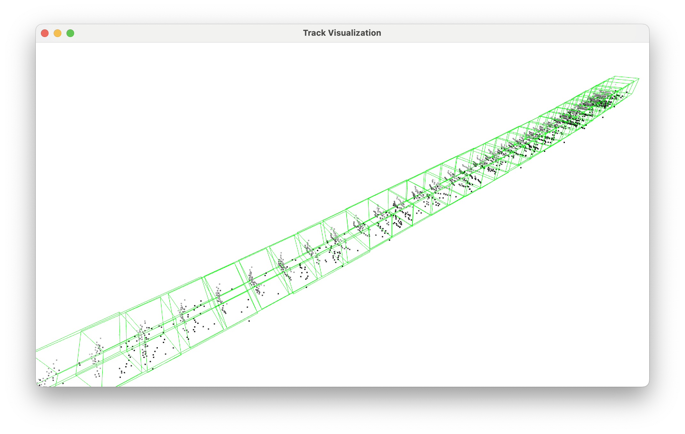

# 3DAL_PyTorch

This is the pytorch implementation of 3DAL proposed by [Qi et. al, "Offboard 3D Object Detection from Point Cloud Sequences", CVPR 2021](https://arxiv.org/abs/2103.05073).

## Introduction

3DAL (3D Auto Labeling) is an offboard 3D object detection pipeline that utilizes point cloud sequences as input. By leveraging the temporal data of objects in the 3D scene, 3DAL can generate high-quality labels, achieving performance comparable to that of experienced humans.

Instead of employing the components outlined in the research paper, we have adopted [CenterPoint](https://arxiv.org/abs/2006.11275) for 3D Object Detection and 3D Multi-Object Tracking. For Static Object Auto Labeling and Dynamic Object Auto Labeling, we have developed our models based on [Frustum PointNets](https://arxiv.org/abs/1711.08488).

## Visualization

Different temporal viewpoints of an object provide complementary information regarding its geometry. By merging the point cloud sequences across consecutive frames, we can attain a more comprehensive representation for static objects and a continuous trajectory for dynamic objects.

| Static Object Tracking Data | Dynamic Object Tracking Data |
|:---------------------------:|:----------------------------:|
| 

 | 

 |

## Installation

Please refer to [INSTALL.md](docs/INSTALL.md).

## Getting Started

Please refer to [GETTING_STARTED.md](docs/GETTING_STARTED.md).

## Acknowledgement

This project is built upon the following codebases:

1. https://github.com/open-mmlab/mmdetection
2. https://github.com/open-mmlab/OpenPCDet
3. https://github.com/tianweiy/CenterPoint
4. https://github.com/charlesq34/frustum-pointnets